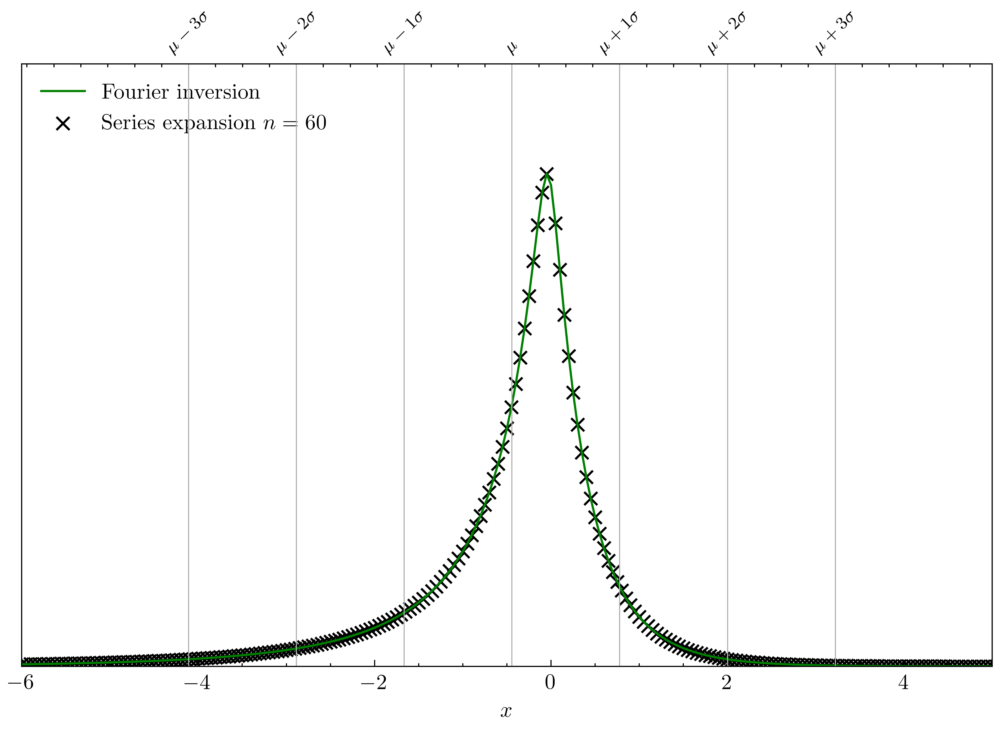
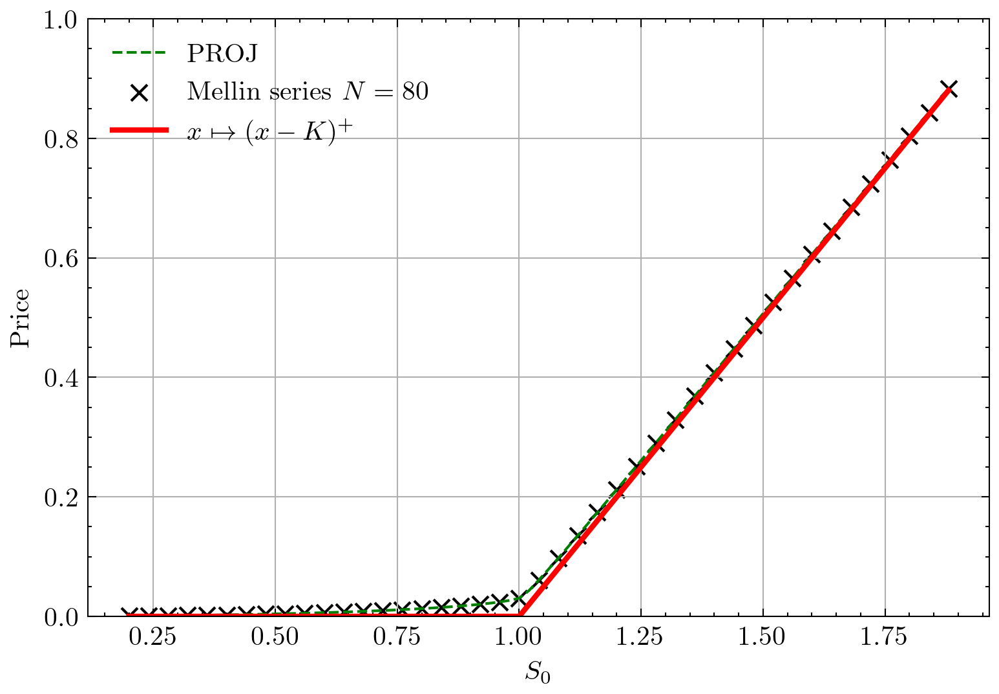
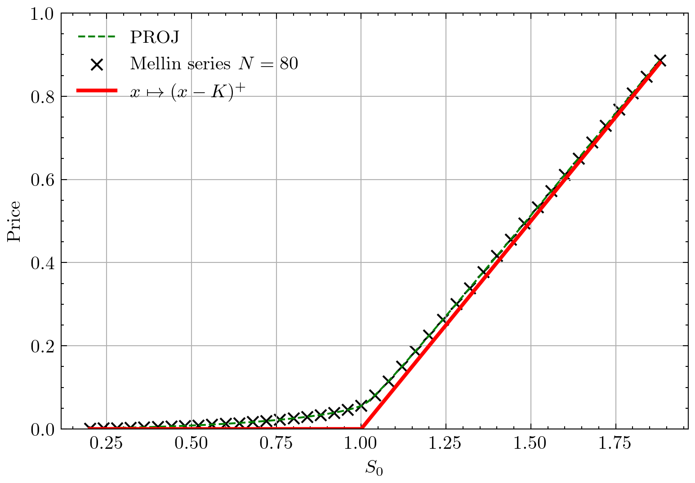
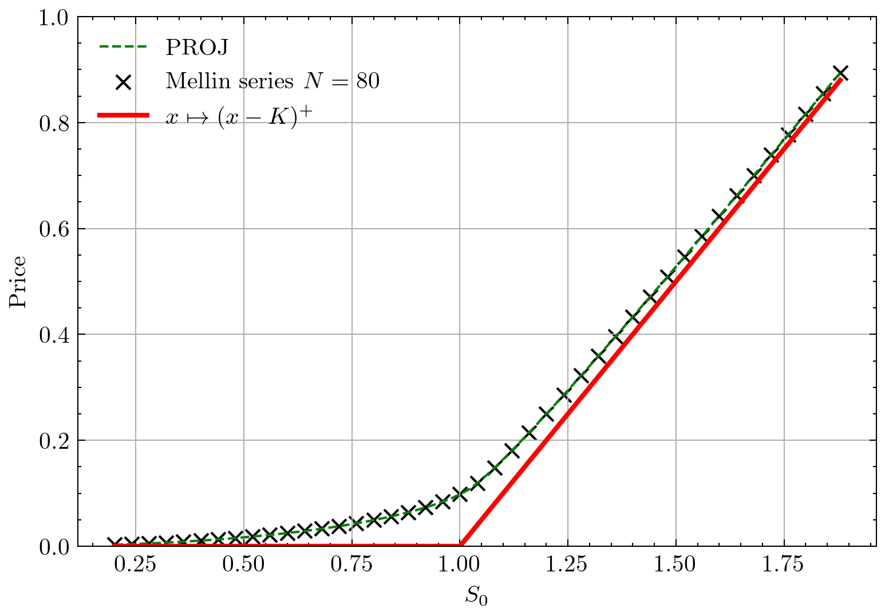
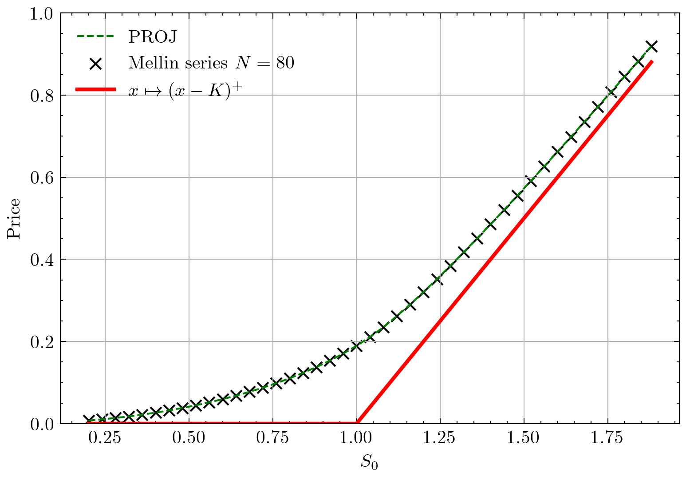
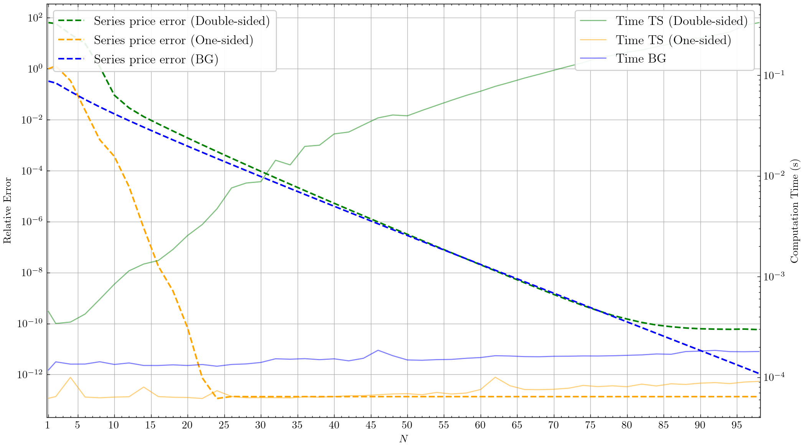

# Option pricing with Mellin series under Tempered Stable process 

[](https://www.python.org/downloads/release/python-31111/)
[](https://pylint.pycqa.org/en/latest/)
[](https://docs.astral.sh/ruff/formatter/)

The code allows to calibrate to price European options with Mellin expansion technique. 
It is the implementation of this paper.

...

## Installation
A script is available for an easy creation of the conda environment and compilation of auxiliary functions:
```bash
source install.bash
```


## How to use - toy example

```python
import numpy as np

from src.mellin_ts.pricers.ts_pricer import TemperedStablePricer

# define the tempered stable parameters
ts_params = {
    "alpha_p": 0.44,
    "beta_p": 0.1 + np.exp(1) / 10,
    "lambda_p": 1.4,
    "alpha_m": 0.35,
    "beta_m": 0.5 - np.pi / 100,
    "lambda_m": 0.4,
}

# define the parameters of the European option
option_params = {"S0": 1,
                 "K": 1.5,
                 "r": 0.02,
                 "q": 0.05,
                 "ttm": 1.2
                 }

# define the associated TS pricer 
ts_p_pricer = TemperedStablePricer(**ts_params)

# call the pricing function
price = ts_p_pricer.price(**option_params, N=80)
```

Please note that one sided Tempered Stable 
and bilateral Gamma pricers are also available
and be used with the same syntax.  
Examples can be found in the ```numerical_experiment``` folder or in the test folder ```tests/complete```.

## Results

### 1. Tempered Stable density 

The class ```TSDensity``` enables to evaluate the series representation given in proposition ...
<div style="display: flex; flex-wrap: wrap; justify-content: center;">
  
</div>


_The image was generated with the code_ ```numerical_experiment/densities.py```.

### 2. Option pricing under Tempered Stable processes

As in the toy example, here is a visual comparison between PROJ method and our series expansion. 

<div style="display: flex; flex-wrap: wrap; justify-content: center;">
  
  
</div>
<div style="display: flex; flex-wrap: wrap; justify-content: center;">
  
  
</div>

A detailed numerical analysis of the three pricers (propositions ...,... and ...) is sum up in the following figure:
<div style="display: flex; flex-wrap: wrap; justify-content: center;">
  
</div>

_p.s.: The first image was generated with the code_ ```numerical_experiment/convergence_s0.py``` and the second with ```numerical_experiment/convergence_test.py```.


## Tests

Two set of tests can be run to check whether pricers are correctly working: short and complete versions. 
The short version is a comparison to one specific PROJ price with ground truth data being hard coded. 
Complete version check the computed prices for a range of strike and maturity. To run them, the following commands can be execute:
```bash
python -m tests.complete.test_suite
python -m tests.quick.test_suite
```

## Interesting ? 

If you have any questions, feel free to contact us. We will be more than happy to answer ! 😀

If you use it, a reference to the paper would be highly appreciated.
## Tested on

[](https://www.releases.ubuntu.com/24.04/)
[](https://docs.conda.io/projects/conda/en/24.9.x/)
[](https://www.intel.com/content/www/us/en/products/sku/195436/intel-core-i510210u-processor-6m-cache-up-to-4-20-ghz/specifications.html)


## Todo

- check that the cpp code gamma_incomp pour upper gamma et upper gamma_vect is the right one (recompile and check)
- check that the conda env is enough to generate the code (add +git@https://...)
- do a toy example
- do the short time behaviour
- remove tests/test_vect.py, ./test.py
- faire computational time comme mtn mais avec différent $N$ pour les deux
- normal que ce soit à 10-13 et pas 10-15 (on regarde en erreur relative!!!!!!!!)
- faire un test pour les densités (éloignés de 0....)


- nom des fichiers snake case
- vérifier que les formules sont valides pour différents temps
- enlever les TBD (Ctrl+F)
- regarder les todo
- implement itm, atm
- BG prices with T
- 3.corriger le nom alpha_m dans proj pour BG, CGMY CMGY nom du module et nom de la classe

